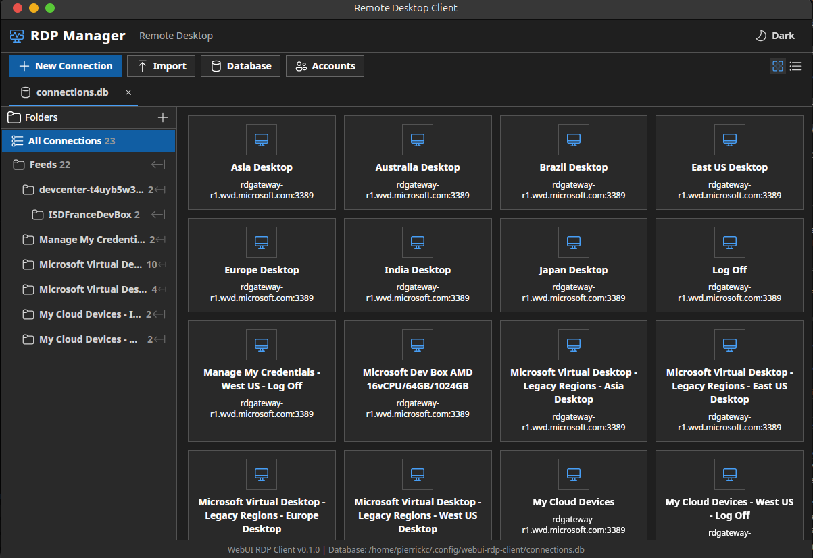

# rdpmanager Documentation

## Overview

rdpmanager is a cross-platform RDP client built in Rust with a React 19 / Fluent UI frontend. It uses WebUI for the native window + WebView bridge and FreeRDP3 for the RDP protocol.

```
React/Fluent UI  ←→  WebUI JS bindings  ←→  Rust backend
                                              ├── RDPLauncher (FreeRDP)
                                              ├── ConfigManager (SQLite)
                                              ├── SessionManager (tabs)
                                              └── EmbeddingHost (window reparenting)
```

## Documentation

| Document | Description |
|----------|-------------|
| [Architecture](architecture.md) | System architecture, crate layout, module responsibilities, data flow, threading model |
| [SQLite & Persistence](sqlite.md) | Database schema, CRUD operations, multi-database support, folder settings inheritance |
| [WebUI & JS Bindings](webui-bindings.md) | WebUI integration, all 35 JS↔Rust bindings, state access pattern, adding new bindings |
| [Embedded Assets](embedded-assets.md) | Build-time UI embedding, VFS serving, disk fallback, single-binary deployment |
| [Debugging](debugging.md) | Logging setup, RUST_LOG usage, build issues, runtime debugging, platform-specific tools |
| [Session Tabs & Embedding](session-tabs.md) | RDP session lifecycle, tab UI, Phase 1/2 embedding plan, FreeRDP settings |
| [Upstream Management](upstream-management.md) | Patch system, CI guardrails, submodule bump and upstream PR workflows |

## Quick Start

```bash
# Development build (disk UI mode)
cd src/ui-react && npm install && npm run build && cd ../..
cargo build
./target/debug/rdpmanager

# Release build (embedded UI — single binary)
cd src/ui-react && npm ci && npm run build && cd ../..
cargo build --release
./target/release/rdpmanager
```

## Project Layout

```
rdpmanager/
├── Cargo.toml              # Workspace root
├── build.rs                # Embedded UI generation + Windows icon
├── src/
│   ├── main.rs             # Entry point
│   ├── config_manager.rs   # SQLite persistence
│   ├── js_handlers.rs      # 35 JS↔Rust bindings
│   ├── rdp_launcher.rs     # FreeRDP session management
│   ├── session_manager.rs  # Session coordination
│   ├── window_embedding.rs # Platform window reparenting
│   ├── types.rs            # Domain types
│   ├── gui/
│   │   └── main_window.rs  # WebUI window + VFS serving
│   └── ui-react/           # React 19 / Fluent UI frontend
│       ├── src/App.tsx
│       ├── src/components/
│       └── src/webui.d.ts
├── crates/
│   ├── webui-sys/          # WebUI C library FFI
│   └── freerdp-sys/        # FreeRDP3 FFI (CMake + bindgen)
├── subprojects/
│   ├── webui/              # Vendored WebUI
│   └── FreeRDP/            # Vendored FreeRDP3
├── docs/                   # This documentation
└── .github/workflows/      # CI/CD
```


